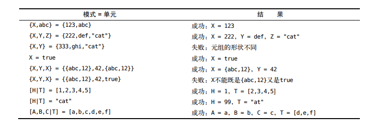
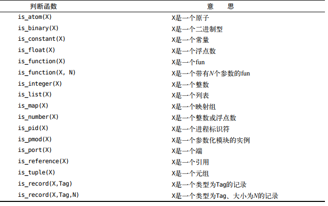
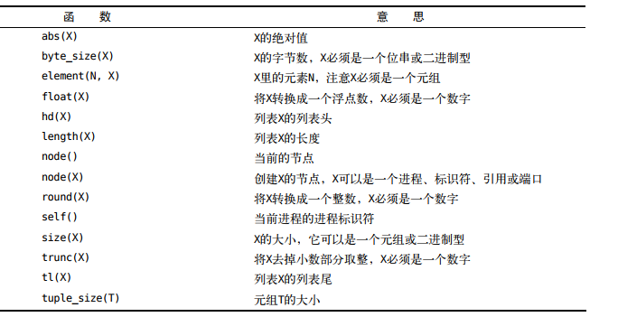

Erlang是函数式编程语言，函数式编程禁止代码存在副作用。
Erlang里没有互斥，同步，也没有内存共享。
各个进程能且只能通过交换消息的方式进行交互。

# 内置函数

1. list_to_tuple/1
2. time/0

# 语法:

## 运算符

1. =

2. =< 小于等于

3. \>= 大于等于

4. =:= 严格等于（数值和类型都相同）

5. == 等于

6. /=不等于

7. =/=严格不等于

8. and or not 注意and和or不是其他语言中的短路运算符，除非使用了andalso或者orelse，and和or会计算全部表达式的值之后再判断，而andalso和orelse则不会

   ```erlang
   12> A = fun(X) when (X == 0) or (1 / X > 2) -> X + 1 end.
   #Fun<erl_eval.44.97283095>
   13> B = fun(X) when (X == 0) orelse (1 / X > 2) -> X + 1 end.
   #Fun<erl_eval.44.97283095>
   14> A(0).
   ** exception error: no function clause matching
                       erl_eval:'-inside-an-interpreted-fun-'(0)
   15> B(0).
   1
   ```

源文件扩展名erl

头文件扩展名hrl

1. ,;.的区别
    - 逗号
        分隔函数调用、数据构造器以及模式中的参数：
        
        ```erlang
        rpc(Pid,M,F,A) ->
            Pid ! {rpc,self(),M,F,A},
            receive
                {Pid,Response} -> 
                    Response
            end.
        ```
        
    - 分号
        是用于分隔子句，几种情况下会用到子句：分段函数的子句，case子句，if子句，try...catch子句，receive子句
        
        ```erlang
        loop() ->
            receive
                {From,{rectangle,Width,Ht}} ->
                    From!Width * Ht,
                    loop();
                {From,{circle,R}} ->
                    From!3.14159 * R * R,
                    loop();
                {From,Other} ->
                    From!{error,Other},
                    loop()
            end.
        ```
        
    - 句号
        句号（.）是跟一个空白符号，用于分隔完整的函数和表达式
    
    **想想英语。句号分隔句子，分号分隔子句，逗号则分隔下级子句。逗号象征短程，分号象征中程，句号则象征长程。**
2. 每一个表达式以.结尾(类比英语语句)
3. %作为注释
4. 变量名必须大写,小写开头的是符号常量(被称为原子)
5. 一旦给变量绑定就无法修改(不同于命令式编程是给变量表示的内存地址赋值)
    ```erlang
    X = 1.
    ```
    
```erlang
%%% 注意最后的.
-module(person).  %%% 应该与文件名一致，必须以小写字母开头
-export([init/1]).  %%% 导出声明，类似public，没有导出的函数无法在模块外调用，
%%% 带有一个参数的init函数可以调用， 但是函数可以有子句
%%% 如何导出多个?
%%% -export([funcname/args_number, funcname/args_number]).
init(Name) -> ...
```

## 发送消息
Pid ! Msg %%%发送msg给进程Pid
eg:

```erlang
Susannah ! {self(), "Hope the message"} 
%%% self()是发送方，Susannah是接收的进程pid
```
## 接收消息
```erlang
receive
  {From, Message} ->
  ...
end
```
当Susannah收到消息时，From会绑定为Joe，message是消息内容
```erlang
receive
  %模式匹配
  Pattern1 ->
    Actions1;
  Pattern2 ->
    Actions2;
  ...
end
```

## 进程， 模块和编译
1. 在shell里编译
	```erlang shell
	c(model_name).  %编译model
	%将会输出{ok,model_name}
	```

	1. 模块内部的函数如何调用?
	```erlang
	model_name:func_name().
	```
	
2. 在命令行编译
   ```shell script
   erlc model.erl  将会生成model.beam的目标代码文件
   erl -noshell -s hello start -s init stop 在命令行运行hello:start().以及init:stop(). 其中init:stop()等价于q().
   help(). 展示shell命令
   ```
   
3. import和export

   ```erlang
     1 -module(shop2).
     2 -export([total/1]).
     3 -import(lists, [map/2, sum/1]). % 导入lists模块下面的两个函数，于是不需要使用完全限定名比如shop:cost
     4
     5 total(L) ->
     6     sum(map(fun({What, N}) -> shop:cost(What) * N end, L)).
   
   ```

   

# 第一章
## 什么是并发
基本函数:
```erlang
%%% 创建并发进程(不是真正的进程，而是erlang管理的轻量级进程)返回进程标识符
process_identify = spawn(ModName, FuncName, [Args1, Args2, ..., ArgsN]).
```

**类比面向对象**
model like class
process like instance

erlang虚拟机提供并发性，自动调度erlang进程给cpu核心

# 第二章
# 第三章
## 进入和退出shell
erl
q().

f().用于解除之前的所有变量的绑定

## 整数运算
没有精度限制
进制:

```erlang
2#10
8#10
16#11
% 2 - 36进制
```

## 浮点数
N div M是让N除以M然后舍去余数。N rem M是N除以M后剩下的余数。


## 变量
**以大写字母开头**
**变量类比于代数(一次赋值多次使用)**，不同于Java,C里面的概念
已被指派一个值的变量称为绑定变量，否则称为未绑定变量。
=是一个模式匹配操作符，它在X为未绑定变量时的表现类似于赋值,在有值的时候进行模式匹配
(内部erlang告诉自己X = 2.这个表达式如何为真，那么X没有绑定时，将2绑定到X，则表达式为真)

## 原子

符号常量，结果是自身

原子以小写字母开头，后接一串字母、数字、下划线（_）或at（@）符号，例如red、december、 cat、meters、yards、joe@somehost和a_long_name。

也可以用单引号来括住，同时可以给无需加''的原子加''，其结果等价

eg:

```erlang
4> aewr.
aewr
5> 'a'.
a
6> a.
a
7> 'fwe gew gt'.
'fwe gew gt'
```

## 元组(类似c里面的结构体)

语法:

使用{}来括住

eg:

```erlang
18> {a, b}.
{a,b}
19> {1, 2}.
{1,2}
20> {1, 2, a, c}.
{1,2,a,c}
21>
% 为了语义明确，推荐的编码风格
22> {person, {name, "Joe"}, {hight, 1.84}}.
{person,{name,"Joe"},{hight,1.84}}
% 即开头使用字段名(虽然erlang并不存在这种说法)
```

**erlang使用垃圾回收机制回收内存**

如果在构建新元组时用到变量，那么新的元组会共享该变量所引用数据结构的值。

### 模式匹配在元组中提取值

```erlang
29> {point, X, Y} = Point.
{point,10,45}
30> X.
10
31> Y.
45
```

**匿名变量**

```erlang
1> Person = {person, {name, joe, armstrong}, {footsize, 42}}.
{person,{name,joe,armstrong},{footsize,42}}
2> {_, {_, Who, _}, _} = Person
.
{person,{name,joe,armstrong},{footsize,42}}
3> Who.
joe
% 允许匿名变量绑定不同的值
```

## 列表

[]

```erlang
19> [1 + 7, hello, 2 - 2, {cost, apple, 30 -20}, 3].
[8,hello,0,{cost,apple,10},3]

```

### 列表头

第一个元素，**列表尾**：是指剩下的（因此通常列表尾仍然是一个列表)

### 扩展列表

[H|T]也是一个列表，它的头是H，尾是T（***虽然没有限制是列表，但是为了库函数的正确应该让T也为列表***)。竖线（|）把列表的头与尾分隔开。**[]是一个空列表**

eg:

```erlang
20> [1, 2, 3| [4, 5]]
.
[1,2,3,4,5]
21> [1, 2, 3|[]].
[1,2,3]
24> A = [1, 2, 3].
[1,2,3]
25> B = [1, 2, 3 | A].
[1,2,3,1,2,3]
```

### 提取列表的值

1. 使用模式匹配

2. 列表的特殊语法

   ```erlang
   31> [C | D] = B.  % 该语法切割列表的头和尾部
   [1,2,3,1,2,3]
   32> C.
   1
   33> D.
   [2,3,1,2,3]
   ```

### 列表推导式

语法:

[X || Qualifier, Qualifier, ...] 

Qualifier:

1. 生成器 Pattern <- ListExpr: 产生X
2. 位串生成器 BitStringPattern <= BitStringExpr: 产生X
3. filter过滤表达式: 对于X进行过滤

```erlang
4> [X || X <- [1, 2, 3, 4], X > 2, X > 3].
[4]
12> [{X, Y} || X <- [1, 2, 3, 4, 5], X > 2, X > 3, Y <- [5, 6, 7, 8]].
[{4,5},{4,6},{4,7},{4,8},{5,5},{5,6},{5,7},{5,8}]

```


[ F(X) || X <- L]标记的意思是“由F(X)组成的列表（X从列表L中提取）

因此，[2 \* X || X <- L ]的意思就是“由2 \* X组成的列表（X从列表L中提取）

```erlang
7> [{Name, 2 * Number} || {Name, Number} <- Buy].
[{oranges,8},{newspaper,2},{apples,20},{pears,12},{milk,6}]
% {Name, Number} <- Buy同时充当了过滤器的作用，只有模式匹配成功的才会进入
```

### ++中缀插入符号

```erlang
1> [1, 2, 3, 4] ++ [4, 5, 6] ++ [5, 6, 7].
[1,2,3,4,4,5,6,5,6,7]
2> [1, 2, 3, 4] ++ [4, 5, 6] ++ [5, 6, 7] ++ [1, f].
[1,2,3,4,4,5,6,5,6,7,1,f]
3> [1, 2, 3, 4] ++ [4, 5, 6].
[1,2,3,4,4,5,6]

```

### --删除符号

X -- Y是列表移除操作符，它从X里移除Y中的元素。

```erlang
6> [a, b, c] -- [a].
[b,c]

```


## 字符串

严格来说没有字符串，erlang是使用整数列表或者二进制形充当，用"str"实际上是str的unicode编码组成的列表

```erlang
1> [97, 98, 99] = "abc".
"abc"
2> [1, 2, 97, 98].
[1,2,97,98]  % 但只有当全部是可打印字符的时候才会显示为字符串
3> "abc\x{61}".
"abca"
```

### 获取字符对应的unicode编码

```erlang
10> A = $a.
97
```

## 模式匹配测试



# 第四章

```erlang
  1 -module(geometry).
  2 -export([area/1]).  % 一个带参函数，参数是tuple
  3 % area函数有两个子句，因此用;间隔
  4 area({rectangle, Width, Height}) -> Width * Height; % 函数返回值默认是最后一个表达式的值
  5 area({square, Side}) -> Side * Side.
% 我们的函数并不处理模式匹配失败的情形，程序会以一个运行时错误结束。这是有意而为的，是在Erlang里编程的方式。 如果以上模式都不匹配，将会报错
```

## fun

函数式编程语言还表示函数可以被用作其他函数的参
数，也可以返回函数。操作其他函数的函数被称为高阶函数（higher-order function），而在Erlang中用于代表函数的数据类型被称为[^fun]。

[^fun]:类似其他语言的lambda

```erlang
7> Double = fun(X) -> 2 * X end.   % end小写切记
#Fun<erl_eval.44.97283095>
```

fun允许有多个子句，**但是和函数多个子句的语法不同**

```erlang
  1 -module(test).
  2 -export([s/1]).
  3
  4 s({x, X}) ->
  5         X + 2;
  6 s({y, Y}) ->
  7         Y - 2.
  8
```

fun的例子:

```erlang
5> TempConvert = fun({c, C}) -> {f, 32 + C * 9 / 5};
                ({f, F}) -> {c, (F - 32) * 5 / 9} end.
#Fun<erl_eval.44.97283095>

```

fun返回fun的例子:

```erlang
15> Fruit = [apple, pear, orange].
[apple,pear,orange]
16> MakeTest = fun(L) -> (fun(X) -> lists:member(X, L) end) end. 
% ()里面的即为返回值
#Fun<erl_eval.44.97283095>
17> IsFruit = MakeTest(Fruit).
#Fun<erl_eval.44.97283095>
18> IsFruit(apple).
true
19> IsFruit(f).
false
```

## when关卡 

```erlang
99> B = fun(X) when X > 3 -> X * 2; (X) -> X end. % 用when关键字来限定模式匹配的进入
#Fun<erl_eval.44.97283095>
100> B(3).
3
101> B(4).
8

```

### 关卡序列

关卡序列（guard sequence）是指单一或一系列的关卡，用分号（;）分隔。对于关卡序列G1;  G2; ...; Gn，只要其中有一个关卡（G1、G2……）的值为true，它的值就为true。

关卡由一系列关卡表达式组成，用逗号（,）分隔。关卡GuardExpr1, GuardExpr2, ... , 
GuardExprN只有在所有的关卡表达式（GuardExpr1、GuardExpr2……）都为true时才为true。

**可以用;和,的思想来区分，逗号表示子句需要所有子句满足条件才为true，而分号为中长句只需要任意一个子句满足条件就为true

```erlang
1>  A = fun(X) when X > 3, X < 5 -> X * 2; (X) -> X end.
#Fun<erl_eval.44.97283095>
2> A(4).
8
3> A(2).
2
4> A(3).
3
5> B = fun(X) when is_integer(X); is_list(X) -> X ; (X) -> "no" end.
#Fun<erl_eval.44.97283095>
6> B(2).
2
7> B("234").
"234"
8> B(234.5235).
"no"

```





## Case语法

```erlang
case Expression of
        Pattern1 [when Grade1] -> Expr_seq1;
        Pattern2 [when Grade2] -> Expr_seq2;
        ...
end
```

先计算Expression的值，然后依次匹配Pattern(附带可选的Grade)

```erlang
filter(P, [H | T]) ->
    case P(H) of
        true -> [H | fiter(P, T)];
        false -> filter(P, T)
    end;
filter(P, []) ->
    [].
```

## if语法

```erlang
if
    A > 2 -> io:format("A > 2");
    true -> io:format("A <= 2")
end.
```

不同于c语言，因为if是一种表达式而所有的表达式都应该具有值

