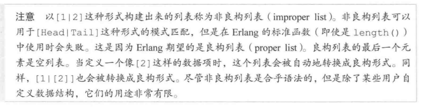

# 经验
1. 尾递归优化-》使用累加器

2. 如何确定累加器及其形式？-》设想处于执行函数的中间阶段，然后看需要什么东西

3. 对于记录，尽管常常将通用的记录定义在.hrl头文件中给模块共同使用，但是对于某些“私有”记录，可以仅仅定义在erl源文件中export该记录的方法

4. 如何精确地匹配自己需要的消息呢？

   1. 使用期待发送者的Pid或者进程名(该方法可能存在Pid由于重启被干掉的进程导致Pid模式匹配失败的情况，或者进程名由于还未重启完成导致发送失败的情况)

      ```erlang 
      start_critic2() ->
          spawn(?MODULE, restarter, []).
      
      restarter() ->
          process_flag(trap_exit, true),
          Pid = spawn_link(?MODULE, critic2, []),
          register(critic, Pid),
          receive
              {'EXIT', Pid, normal} ->
                  ok;
              {'EXIT', Pid, shutdown} ->
                  ok;
              {'EXIT', Pid, _} ->
                  restarter()
          end.
      
      %%judge2(Band, Album) ->
      %%    critic ! {self(), {Band, Album}},
      %%    Pid = whereis(critic),  %% 或者在此刻critic进程已经挂掉，导致whereis获取失败
      %%    receive
      %%        %% 目前存在Pid可能因为重启导致和使用whereis获取到的Pid不一致的情况，
      %%        %% 虽然本意是确保精确接收critic发送的消息
      %%        {Pid, Criticism} -> Criticism
      %%    after 2000 ->
      %%        timeout
      %%    end .
      judge2(Band, Album) ->
          Ref = make_ref(),
          critic ! {self(), Ref, {Band, Album}},
          receive
              {Ref, Criticism} -> Criticism
          after 2000 ->
              timeout
          end .
      
      critic2() ->
          receive
              {From, Ref, {"Rage Against the Turing Machine", "Unit Testify"}} ->
                  From ! {Ref, "They are great!"};
              {From, Ref, {"System of a Downtime", "Memoize"}} ->
                  From ! {Ref, "They're not Johnny Crash but ther're good."};
              {From, Ref, {"Johnny Crash", "The Token Ring of Fire"}} ->
                  From ! {Ref, "Simply incredible."};
              {From, Ref, {_Band, _Album}} ->
                  From ! {Ref, "They are terrible!"}
          end,
          critic2().
      ```

      

   2. 使用make_ref()的方式创建引用，每次发送消息的时候使用该引用来标记消息

# 序言


1. 容错性（乃至进程级别）
2. 公平调度（不采用时间片算法，Erlang的进程调度不是使用时间片的分配， 而是给每个进程或Port分配一个reduction budget, 默认值是2000. 每个操作都会花费reduction, 一旦reduction budget用完，该进程就会释放CPU，然后被重新调度）
3. 设计原则（let it crash面向崩溃和面向协议-》微服务架构），Erlang系统类比一个小型的互联网系统，每个进程对应一台主机，进程间的消息对应于协议，一个进程的崩溃不会影响其他进程

---

Erlang函数式编程语言

1. 对于同样的参数，函数永远返回同样的值（引用透明性，referential transparency）

2. 采用actor模型，每个actor都是虚拟机的一个独立进程（独自坐在黑屋子里面收信回信的人）

3. 代码编译成字节码，字节码运行在虚拟机中

4. 热拔插（在不中断程序的情况下升级运行系统的代码）

5. 声明式的思想

   ```erlang
   func(Exp) when is_binary(Exp) -> Expression1;
   func(Exp) when is_list(Exp) -> Expression2.
   ```

   ```python
   def func(exp):
       if isinstance(exp, bytes):
           pass
       elif isinstance(exp, list):
           pass
       else:
           pass
   ```

   

组件：

1. 开发工具（编译器，调试器，性能分析器，测试框架，类型分析器）

2. 开放电信平台Open Telecom Platform框架
3. Web服务器
4. 高级跟踪工具
5. Mnesia数据库（k-v存储系统）

强项：

1. 服务端的大型软件（中间件，web服务器，实时系统，分布式数据库）

文档：

	1. Linux ：erl -man lists
	2. 或者直接使用man lists


# 第一章：启程

Shell：erl or werl（适用于win）

Erlang shell基于Emacs行编辑器（Ctrl+a移动到行开头，Ctrl+e移动到行尾），支持tab智能补齐

help().

Erlang Shell是一组shell实例，每个实例运行着不同的job（可类比bash）


## 数据类型

1. 数值类型

   不关心是浮点数还是整数，div是整除，rem是余数（remainder余数）

   语法:

   base#number 表示不同进制的数据

2. 原子

   原子是字面量（小写开头，或者用单引号包裹住）

   **原子引用到原子表中，不会被GC掉，64位系统每个原子占据8个字节**

   内置的原子

   

3. 布尔及其比较操作符

   true false

   and、or、andalso、orelse（后面两个为短路运算）

   ==、=:=、/=、=/=（通常使用=:=和=/=，因为在比较的时候erlang是区分浮点数和整数的）

   <、>、>=、=<（注意最后的小于等于)

   尽管erlang不允许不同类型之间的计算，但是允许比较，这是因为存在

   **number < atom < reference < fun < port < pid < tuple < list < bit string**

   ```erlang
   2 < true.  % 结果为true.因为number < atom
   2 < a.     % true不要视作为1应该看成atom
   ```

4. 元组

   语法：{Element1, Element2}

   集合atom来说明数据

   ```erlang
   {point, {3, 4}}.
   ```

5. 列表(字符串就是列表)

   语法: [Element1, Element2, ..., ElementN].

   ```erlang
   [97, 98, 99]. % "abc" 不过只有当全部都代表可打印字符的时候才会视作字符串，历史原因爱立信（电信）公司从不使用字符串
   ```

   ++拼接

   -- 移除

   **第一个元素成为head，其他部分称为tail，因此head是一个元素，和tail仍然是list**

   ```erlang
   114> hd([1, 2, 3]).
   1
   115> tl([1, 2, 3]).
   [2,3]
   ```

   由于访问头元素和增加头元素效率高

   [Head | Tail]语法来拆分列表或者新增元素

   ```erlang
   120> [a, b, c, d].
   [a,b,c,d]
   121> [a, b, c, d | []].
   [a,b,c,d]
   122> [a, b | [c, d]].
   [a,b,c,d]
   123> [a, b | [c | [d]]].
   [a,b,c,d]
   124> [a | [b | [c, d]]].
   [a,b,c,d]
   ```

   

   列表推导式

   语法:

   NewList = [Expression || Pattern <- List, Pattern<- List, Condition1, Condition2, ...ConditionN]

   Pattern<-List叫做生成器表达式

   ```python
   [Expression for Parrten in List for Pattern in List if Condition1 and Condition2]
   ```

   ```erlang 
   136> [{X, Y, Z} || X <- [1, 2, 3], Y <- [4, 5], Z <- [6]].
   [{1,4,6},{1,5,6},{2,4,6},{2,5,6},{3,4,6},{3,5,6}]
   138> Place = [P || {P, X} <- Weather].
   [toronto,montreal]
   ```

6. 二进制数据

   1. 位语法

      ```erlang 
      <<Value, Value>>
      <<Value:Size>> % 默认是bit作为单位
      <<Value/TypeSpecifierList>> 
      <<Value:Size/TypeSpecifierList>>
      ```

   ### 关于TypeSpecifierList的说明（由以下一个或多个组成，使用-分隔）

   1. 类型（默认integer)

      integer, float, binary, bytes, bitstring, bits, utf8, utf16, utf32(bytes是binary的缩写，bits是bitstring的缩写)

   2. 有无符号(默认unsigned，只有当类型是integer的时候才算)

      signed,unsigned

   3. 字节序(默认是big)

      big, little, native**只有类型为integer，utf16，utf32或者float才有意义**

   4. unit
      **需要注意必须同时指定size**
      unit:区段大小

      是指每一个区段的大小，范围是1-256

      对于integer，float，bitstring类型来说，unit:1这是默认设置

      对于binary类型来说unit:8这是默认设置

      对于utf8,utf16,utf32无需定义unit

      size和unit的乘积等于该区段中所提取的位数

      **可以看作强转为type类型，sigined或者unsigned，字节序是决定如何解释，unit乘以size表示提取的bit数目**

   2. 位运算

      bsl, bsr, band, bor, bxor, bnot(左移，右移，与，或，亦或，非)

   3. 二进制字符串（更像是数组，list则是链表）

   4. 二进制推导式

      语法:

      ```erlang
      << <<R:8, G:8, B:8>> || {R, G, B} <- RGB>>.
      <<213,45,132,64,76,32,76,0,0,234,32,15>>
      
      << <<R:4, G:8, B:16>> || {R, G, B} <- [{1, 2, 3}] >>.
      <<16,32,0,3:4>>  % 该结果是指1解释为占据4bit，2占据8bit，3占据16bit，之后重新按照每8bit来解释
      %%  0001 0000 0010 0000 0000 0000 0011
      %%  16,       32,       0,        3:4
      ```

7. \_

   用于填充占位，始终是unbound

## 不变的变量

大写字符开始的命名规则（虽然可以用\_开头，但是这种变量用途一般是不关心它的值）

# 第二章：模块

erlang中的所有函数都必须定义在模块中

erl文件后缀

调用的语法:

Module:Function(Arguments)

除了erlang模块默认导入

## 模块语法

**关于注释的说明**

```erlang
%%% Created : 17. 1月 2021 20:26 大段的说明
%%%-------------------------------------------------------------------
-module(unless).
-author("12409").

%% API
-export([add/2, hello/0, greet_and_add_two/1]).

add(A, B) ->
    A + B.

%%  显示欢迎
%%  io:format/1是标准的文本输出函数，函数说明
hello() ->
    io:format("Hello, World! ~n"). % 单个百分号，表达式说明

greet_and_add_two(X) ->
    hello(),
    add(X, 2).
```


1. 模块允许定义两个东西

   1. 函数

      ```erlang
      Name(Args) -> Body. % Name必须是原子，Body可以是一个或多个,分隔的erlang表达式
      %% 函数的最后一个表达式自动作为返回值
      ```

   2. 属性（元数据，用来描述模块的，eg:模块名，作者)

      属性的语法:

      ```erlang 
      -Name(Attribute). % -author("12409").
      ```

      其中module

      ```erlang
      -module(Name). % 必须定义，永远是第一个属性，也是第一条语句，Name为文件名
      ```

      其中export

      ```erlang 
      -export([Function1/Arity, Function2/Arity, ...]). % 用于导出函数
      ```

      其中import

      ```erlang
      -import(Module, [Function1/Arity, Function2/Arity, ...]). % Erlang程序员一般不使用，无法区分不同模块同名函数的情况
      ```

## 编译

```bash
erlc file.erl
```

```erlang shell
c() 
compile:file(FileName) % eg: compile:file(unless).    
cd(Path). % 用于切换工作目录 
```

生成.beam文件

### 编译选项

debug_info

{outdir, Dir}

export_all

{d, Macro}和{d, Macro, Value}默认宏为true

**如何使用编译选项?***

```erlang shell
compile:file(FileName, [CompleteOption, CompleteOption, ...])
c(FileName, [CompleteOption, CompleteOption, ...])
```

**hipe相关模块允许编译成本地代码版本的beam**

## 宏

语法

```erlang
-define(MACRO, some_value). % 作用同于c语言的define
-define(sub(X, Y), X - Y). % 宏函数
```

如何使用宏？

```erlang
?MACRO
```

**预定义宏**

?MODULE当前模块名

?FILE当前文件名

?LINE当前行号

```erlang
-ifdef(DEBUGMODE).
-define(DEBUG(S), io:format("dbg: "++S)).
-else.
-define(DEBUG(S), ok).
-endif.
```

## 元数据

module:module_info().

module:module_info/1.用于获取具体的元数据

其中vsn是自动生成的唯一值，用于区分不同版本

# 第三章：函数

每一条子句使用;间隔

io:format格式化输出使用~来占位，~s支持字符串或者字节串，~n换行，~p输出和shell相同的结果（可视为python的repr)

**erlang函数中=的作用**

```erlang
%% =的作用，在匹配Y,M,D的同时，匹配整个元组
valid_time({Date = {Y, M, D}, Time = {H, Min, S}}) ->
    io:format("The Date tuple (~p) says today is: ~p/~p/~p,~n", [Date, Y, M, D]),
    io:format("The time tuple (~p) indicates: ~p:~p:~p.~n", [Time, H, Min, S]);
valid_time(_) ->
    io:format("Stop feeding me wrong data!~n").
```

## guard语句

允许使用比较和布尔运算符，及其内置函数，禁止用户自定义函数（由于erlang非完全的函数式语言，存在依赖于副作用的地方，比如io操作)

```erlang
%% 在guard中,等同于andalso;则等同于orelse
%% 但是,和;会无视异常这就意味着X < 16的时候出现异常仍然会对X > 104求值，结果可能成立
%% 而andalso和orelse当某个条件存在异常的时候不再进行下一个表达式求值
%% 同时,和;不允许嵌套，而andalso和orelse允许嵌套
old_enough(X) when X >= 16, X =< 104 -> true;
old_enough(_) -> false.

wrong_age(X) when X < 16; X > 104 -> true;
wrong_age(_) -> false.
```

## if语句(除了使用地方，其他等同于guard，包括限制条件)

允许使用比较和布尔运算符，及其数据类型判断函数，禁止用户自定义函数

由于每个表达式都需要有返回值，if也不例外因此

```erlang
 if 1 =:= 2, 1 =:= 1 ->
        fails
 end.
 %% 会直接报错无法匹配
```

## case of表达式

case of则不受限guard的限制条件(允许使用自定义函数)

```erlang
beach(Temperature) ->
    case Temperature of
        {celsius, N} when N >= 20, N =< 45 ->  % 可以接guard语句
            'favorable';
        {kelvin, N} when N >= 293, N =< 318 ->
            'scientifically favorable';
        {fahrenheit, N} when N >= 68, N =< 113 ->
            'favorable in the US';
        _ ->
            'avoid beach'
    end.
```

# 第四章：类型

**Erlang动态强类型语言**

更适用于热加载

## 类型转换（大部分都erlang模块提供)

typeA_to_typeB格式


## 类型判断及其内置函数


---


# 第五章：递归

尾递归:不是指函数最后一条语句包含了调用自身的表达式，而是说递归函数是最后一个求值的表达式

```erlang
zip([], []) -> [];
zip([H1 | O1], [H2 | O2]) -> [{H1, H2} | zip(O1, O2)].

tail_zip(L1, L2) -> tail_zip(L1, L2, []).
tail_zip([], [], Result) -> Result;
tail_zip([H1 | O1], [H2 | O2], Result) -> tail_zip(O1, O2, Result ++ [{H1, H2}]).
```

尾递归优化是尾调用优化的特例


# 第六章：高阶函数

由于直接写函数名会被视为原子，特殊语法使用

fun Module:Function/Arity来表示

## 匿名函数

fun

```erlang
fun(Args1) ->
    Expression1, Expression2, ..., ExpressionN;
    (Args2) ->
    Exp1, Exp2, ... Exp3
end
```

## 闭包

eg: 

```python
from functools import partial
```

```erlang
power_of_n(N) ->
    fun(X) -> math:pow(X, N) end.
```

## lists的一些高阶函数


# 第七章：错误和异常
**异常也可以用于类似goto的效果，比如寻找某个元素，找到后直接throw，在最外层捕获即可**

## 引发异常

throw->error->exit异常级别逐步上升(如果没有捕获对应的异常话)

三种异常
### 出错异常
erlang:error(引发运行时错误，可打印堆栈) 
### 退出异常
exit/1 (内部退出)
exit/2 (外部退出)
其他进程可以接受进程发出的退出消息，从而记录日志或者重启死亡的进程
### 抛出异常
throw

## 捕获异常
语法基本同于case ... of
```erlang
%%    try
%%        Expression, Expression, Expression of  % of部分是可选的
%%        SuccessFulPattern1 [Guards] ->
%%            Expression1;
%%        SuccessFulPattern2 [Guards] ->
%%            Expression2
%%    catch
%%        TypeOfError:ExceptionPattern1 -> Expression3; 异常的类型为error或者exit或者throw默认为throw
%%        TypeOfError:ExceptionPattern2 -> Expression4
%%    end .
```
例子
```erlang
black_knight(Attack) when is_function(Attack, 0) ->
    R =
    try Attack() of
        _ -> "None shall pass."
    catch
        throw:slice -> "It is but a scratch.";
        error:cut_arm -> "I've had worse.";
        exit:cut_leg -> "Come on you pansy!";
        _:_ -> "Just a flesh wound"  % 捕获任意类型异常(throw, error, exit)，匹配任意情况
    after
        "free resource"  % 该语句一般运行具有副作用的代码比如释放资源，不作为返回值
    end,
    io:format("~p ~n", [R]).
```
---
允许try和of之间存在多个表达式
```erlang
whoa() ->
    try
        talk(),
        _Knight = "None shall pass!",
        _Doubles = [N * 2 || N <- lists:seq(1, 100)],
        throw(up),
        _WillReturnThis = tequila  % 上述部分无法做到尾递归优化, VM需要保持引用防止异常
    of
        tequila -> "Hey, this worked"  % 该地方支持尾递归优化，不过需要抛弃after语句
    catch
        ExceptionType:Reason  -> {caught, ExceptionType, Reason}
    end.
```

## catch关键字捕获异常
```erlang
44> catch throw(whoa).
whoa
45> catch exit(23).
{'EXIT',23}
48> catch doesnt:exits(a, 4).
{'EXIT',{undef,[{doesnt,exits,[a,4],[]},
                {erl_eval,do_apply,6,[{file,"erl_eval.erl"},{line,684}]},
                {erl_eval,expr,5,[{file,"erl_eval.erl"},{line,437}]},
                {shell,exprs,7,[{file,"shell.erl"},{line,686}]},
                {shell,eval_exprs,7,[{file,"shell.erl"},{line,642}]},
                {shell,eval_loop,3,[{file,"shell.erl"},{line,627}]}]}}
```
**解读错误信息:{'EXIT', {undef(未定义), [调用栈帧]}}**

调用栈帧:{ModuleName, FunctionName, Args, [Detail_info比如文件名，行号]}

---
**X = (catch 2 / 0).**

**不过无法区分结果**

```erlang
one_or_two(1) -> return;
one_or_two(2) -> throw(return).

catch one_or_two(1)
catch one_or_two(2)  % 结果都是return
```

# 第八章
如何直接执行erlang程序
eg:
func最后使用erlang:halt/0来终止erlang vm
```bash
erl -noshell -run module func args
```

或者使用escript作为脚本来执行 

```erlang
#!/usr/bin/escript 
%% 无需-module(file).
main(StringArgs) ->
    io:format("~p~n", [StringArgs]).

```

escript file.erl即可

# 第九章：常用数据结构简介

## 记录

类似c语言结构体，python的namedtuple

同时允许默认值，仅仅是erlang元组的语法糖

```erlang shell
rr(module).  % 读取模块
rr(module, recordName).  % 读取记录
rd(Name, Definition)  % 定义一个记录
rf().  % 移除所有记录
rl().  % 把当前存在的记录打印出来
rl(Name).
rl([Names]).
```

----

定义的语法

```erlang
-record(recordNameAtom, {fieldNameAtom, fieldNameAtom = DefaultValue}).
```

使用记录的语法

```erlang
#record{field = FieldValue}.  % 即可
```

提取某个记录的字段

```erlang
RecordVal#record.field  % 获取RecordVal该变量的field的值
```

修改记录

```erlang 
NewRecord = OldRecord#record{field=NewValue}.
```

**优点**

对于没有填充的字段视为undefined，允许默认值，同时若仅仅需要匹配某个字段的时候，再将来业务扩展时无需修改函数的定义

```erlang
-record(user, {id, name, group, age}).

%% 模式匹配
admin_panel(#user{name=Name, group=admin}) ->
    Name ++ " is allowed!";
admin_panel(#user{name = Name}) ->
    Name ++ " is not allowed.".

%% 若某一天需要新增字段
%% 则上述函数无需修改
%% 若不使用记录，则每次都需要修改涉及该元组的函数
admin_panel({_, Name, admin, _}) ->
    Name ++ " is allowed!";
admin_panel({_, Name, _, _}) ->
    Name ++ " is not allowed.".
```

### 头文件

file.hrl

-include("file.hrl").

## 键值对

### 小数据量的存储

1. 属性列表(proplist) 一般用于描述属性

   形如[{Key, Value}]

   proplists模块封装了上述操作

2. 有序字典(orddict)

   orddict模块

   支持CURD

### 大数据量的存储

dict模块

gb_trees模块(通用平衡树)(存在两种模式，一种是简单模式不知道自己的数据在树中的存在情况，一种是智能模式默认知晓keyvalue在树中的存在情况此时会绕过所有安全检查)

## 集合

ordsets

sets

gb_sets(一般情况)

sofs(集合的集合)

## 有向图

digraph

digraph_utils

## 队列

queue模块


# 并发

# 第十章

软件层面的容错：尽快杀死错误的进程，这就是erlang轻量级进程的解决方案

硬件层面的容错：分布式，这就是erlang消息机制的解决方案

异步消息的轻量级进程：

1. 对于崩溃的进程让其崩溃不影响其他数据
2. 封装分布式
3. 异步消息（邮箱存放未处理的消息）

VM会为每一个核心启动一个线程来做为调度器，每个调度器都有一个运行队列（也就是erlang的进程列表)

---


在一些串行任务中，可以开启，erlang禁用SMP的设置

```bash
erl +S 1
```

如何查看是否启用了SMP

进入erlang shell即可 

```erlang
Erlang/OTP 23 [erts-11.1] [source] [64-bit] [smp:4:4] [ds:4:4:10] [async-threads:1]
%% [smp:4:4]表示运行在四核上面使用了四个运行队列
```


## erlang关于进程的语法

1. 创建进程

   spawn()返回pid

2. 发送消息

   pid ! message 

   ```erlang shell
   flush().  % 可以查看当前shell中的消息
   ```

   **如何一次性发送多条消息?**

   self() ! self() ! message.

   等价于

   self() ! (self() ! message) 因为erlang表达式即为返回值

3. 接受消息 

   内部维护消息队列，当消息匹配的时候才会取走消息，否则消息停留在队列中

   语法类似case of，因此也允许有guard语句

   self()获取自身pid

   ```erlang
   receive
   	Match when Guard1 ->
           do_something
   after Delay(毫秒) ->
       	do_something
   end.
   %% 如何获取发送方，可以在发送消息的同时发送自身的pid
   receive 
   	{From, Message} -> 
           do_something
   end.
   ```


#  第十一章：深入多重处理

更多的是并发编程的经验

1. 发送消息的时候传递自身pid

   ```erlang
   receive 
   	{From, Message} -> 
           do_something
   end.
   ```

   

2. 使用递归函数本身的参数来存储状态

   ```erlang
   fridge2(FoodList) ->
       receive
           {From, {store, Food}} ->
               From ! {self(), ok},
               fridge2([Food | FoodList]);
           {From, {take, Food}} ->
               case lists:member(Food, FoodList) of
                   true ->
                       From ! {self(), {ok, Food}},
                       fridge2(lists:delete(Food, FoodList));
                   false ->
                       From ! {self(), not_found},
                       fridge2(FoodList)
               end ;
           terminate ->
               ok
       end.
   ```

   

3. 封装发送消息的语法

   ```erlang
   store(Pid, Food) ->
       Pid ! {self(), {store, Food}},
       receive
           {Pid, Msg} -> Msg
       end.
   
   take(Pid, Food) ->
       Pid ! {self(), {take, Food}},
       receive
           {Pid, Msg} -> Msg
       end.
   ```

4. 使用after来设置超时情况 或者infinity

   ```erlang 
   sleep(T) ->
       receive
       after T -> ok  % 意义是指不匹配任何消息(发送的消息仍然停留在消息队列中)，仅仅延时
       end .
   
   flush() ->
       receive
           _ -> flush()
       after 0 ->  %% 意义是指没有消息的时候直接结束
           ok
       end.
   ```
---
**erlang消息机制**


会对于上次匹配后残留的消息存放在一个单独队列中，当下一次receive的时候将残留的消息移动到新消息队列的开头，由于这个机制若是存在大量无用的消息会导致**内存增长，性能下降**

# 第十二章：错误与进程

## 链接

一个进程因为throw，exit，error导致死亡时，另外一个进程也会死亡，可以获知之前死亡进程的原因(即throw(reason)的reason)

link/1

unlink/1

spawn_link/1-3 （用于原子操作) 这是因为link(spawn())该操作不是原子的，有可能spawn的进程在link成功之前已经执行完或者已经死亡，导致link失败

---

**如何创建一个进程组，彼此link**

```erlang
chain(0) ->
    receive
        _ -> ok
    after 2000 ->
        exit("chain dies here")  % 若2秒后没有匹配成功的消息（在这个例子中由于使用_则意义是指没有消息)的时候抛出exit异常
    end;
chain(N) ->
    Pid = spawn(fun() -> chain(N - 1) end),
    link(Pid),
    receive
        _ -> ok
    end.
```

 ### 如何捕获退出的信号？（传统的trycatch无法使用)

使用process_flag(trap_exit, true).即可，用于捕获当前进程发出的退出信号

```erlang
7> spawn_link(linkmon, chain, [3]).
<0.96.0>
8> receive X -> X end.
{'EXIT',<0.96.0>,"chain dies here"}
                    
13> exit(self(), 24).
true
14> flush().
Shell got {'EXIT',<0.89.0>,24}
ok

```

**关于kill的理解**

该信号无法被捕获(process_flag(trap_exit, true)无法捕获)，erlang为了避免kill掉一个进程导致其他关联的进程全部被kill，于是传递给其他进程的退出原因改成了killed，但是对于被kill掉的进程接受到的信号实际上就是kill

## 监控器

特殊的链接

1. 监控器是单向的

2. 在两个进程之间可以设置多个监控器（允许叠加，不同于链接叠加无效）每个监控器有自己的唯一标识 

**为什么需要监控器？而不用链接**

比如第三方库A：依赖于A进程链接C进程

第三方库B：取消了A进程和C进程的链接（由于链接叠加无效，断开会导致第三方库A失效）

monitor/2

```erlang
15> monitor(process, spawn(fun() -> timer:sleep(400) end)).
#Ref<0.1105416651.970457089.178151>  % 该引用是监视器的唯一标识
16> flush().
Shell got {'DOWN',#Ref<0.1105416651.970457089.178151>,process,<0.113.0>,
                  normal}
ok
```

spawn_monitor(原子操作的版本)

---

取消监视器

demonitor/1-2

demonitor(Ref, [flush, info]).  % flush是指取消消息队列中的DOWN消息，info是表明取消监视器的时候被监视的进程是否还存在

## 命名进程

给进程命名，而不再使用Pid（该场景用于重启进程的时候，但是外部又无法获知需要重启的进程的Pid)

register(nameAtom, Pid)

unregister/1

registered/0 获取所有注册的进程的列表

whereis(nameAtom)  % 获取该进程名的pid

# 第十三章：并发应用设计


## 代码热更新

erlang内置了code server，它是一个VM进程，存在一个本地版本，一个最新版本，使用完全限定(Module:Function(Args)会调用最新版本，使用本地调用会使用本地版本Name(Args)，VM虚拟机自动根据调用的方式采用哪一个版本

```erlang 
-module(hotload).
-export([server/1, upgrade/1]).

server(State) ->
    receive
        update ->
            NewState = ?MODULE:upgrade(State),
            ?MODULE:server(NewState);  %% 进入新版本的循环中
        SomeMessage ->
            server(State)  %% 保持当前运行的模块版本中
    end.

upgrade(OldState) ->
    % 转换新版本并返回新的状态
    1.
```

## Emakefile

eg: 表明编译source/下面的erl文件，开启debug_info编译选项，从source，include中寻找hrl头文件，编译结果保存在outdir下

```Emakefile
{'source/*', [debug_info,
        {i, "source"},
        {i, "include"},
        {outdir, "ebin"}]}.
```

如何编译?

erl -make 或进入shell后make:all([load]) 后者会自动导入模块

erl -pa path % 用于告诉VM将path目录添加到模块搜索路径中

## 监督者的一般写法

```erlang
-module(sup).
-author("12409").
-compile(export_all).
%% API
-export([]).

start(Mod, Args) ->
    spawn(?MODULE, init, [{Mod, Args}]).

start_link(Mod, Args) ->
    spawn_link(?MODULE, init, [{Mod, Args}]).

init({Mod, Args}) ->
    process_flag(trap_exit, true),
    loop({Mod, start_link, Args}).

loop({M, F, A}) ->
    Pid = apply(M, F, A),  % 类似于Python的exec
    receive
        {'EXIT', _From, shutdown} ->
            exit(shutdown);
        {'EXIT', Pid, Reason} ->
            io:format("Process ~p exited for reason ~p~n", [Pid, Reason]),
            loop({M, F, A})  % 重启死亡进程
    end.
```

## 命名空间

code:clash/0 可以用于检查是否存在冲突

因为是扁平化没有模块结构的概念，一般是加上项目名作为模块前缀

# 第十四章：OTP简介

OTP开放电信平台框架

## 提炼通用进程

eg:
```erlang
-module(my_server).
-author("12409").
-compile(export_all).
%% API
-export([start/2, start_link/2, call/2, cast/2, reply/2]).

%% 公共的API
start(Module, InitialState) ->
    spawn(fun() -> init(Module, InitialState) end).

start_link(Module, InitialState) ->
    spawn_link(fun() -> init(Module, InitialState) end).

%% 用于对Pid发送消息并接受消息，同时内部自动处理超时情况，Pid关闭情况
%% 同时确保消息来源的正确性通过Ref
%% 等价于对于请求的封装
call(Pid, Msg) ->
    Ref = monitor(process, Pid),
    Pid ! {sync, self(), Ref, Msg},
    receive
        {Ref, Reply} ->
            demonitor(Ref, [flush]),
            Reply;
        {'DOWN', Ref, process, Pid, Reason} ->
            error(Reason)
    after 5000 ->
        error(timeout)
    end.

cast(Pid, Msg) ->
    Pid ! {async, Msg},
    ok.


reply({Pid, Ref}, Reply) ->
    Pid ! {Ref, Reply}.


%%% 私有函数
%% 泛型的服务端消息循环
%%loop(Module, State) ->
%%    receive
%%%%        Message ->
%%%%            Module:handle(Message, State)
%%        {async, Msg} ->
%%            loop(Module, Module:handle_cast(Msg, State));
%%        {sync, Pid, Ref, Msg} ->
%%            loop(Module, Module:handle_call(Msg, Pid, Ref, State))  % 调用该通用服务器循环的程序员需要知道定义了Pid， Ref导致抽象暴露
%%    end.

%% 用于消息循环和处理消息功能切割
%%handle(Message1, State) -> NewState1;
%%handle(Message2, State) -> NewState2.
loop(Module, State) ->
    receive
        {async, Msg} ->
            loop(Module, Module:handle_cast(Msg, State));
        {sync, Pid, Ref, Msg} ->
            loop(Module, Module:handle_call(Msg, {Pid, Ref}, State))
        %% 超时配置，非期望的消息，代码热加载，特殊错误，公共回复，服务器关闭，与监督器的搭配都未实现
    end.

init(Module, InitialState) ->
    loop(Module, Module:init(InitialState)).

```
## gen_server行为
### init函数
init/1 
负责初始化服务器的状态，并完成所有需要一次性的任务
```erlang
init(State) ->
    %% 执行初始化任务
    TimeOut = undefined,
    Reason = undefined,
    {ok, State},  % State会作为服务器状态一直传递
    %% 可以给服务器设置一个TimeOut用于表示服务器需要在TimeOut收到客户端发来的一条消息
    %% 若超时则服务器会收到timeout消息，服务器可以通过hand_info/2来处理，不过由于任意一条消息都会重置TimeOut因此不推荐使用
    %% 更多地使用start_timer/3之类的
    {ok, State, TimeOut},
    %% 在执行程序的时候，可以让不需要运行的进程进入休眠状态，erlang:hibernate，可以极大的减少内存和CPU的消耗，而当有消息专递给该进程后，则退出休眠状态。(但是往往只用于确实服务器很长时间不会收到消息)
    %% erlang会进行清空栈帧，然后进行垃圾回收
    {ok, State, hibernate},  
    {stop, Reason},
    ignore. 
```
执行该函数时进程会阻塞，因为在等待gen_server的就绪消息

### handle_call
```erlang
handle_call(Request, From, State) ->
    Reply = undefined,
    NewState = undefined,
    TimeOut = undefined,
    Reason = undefined,
    {reply, Reply, NewState},
    {reply, Reply, NewState, TimeOut},
    {reply, Reply, NewState, hibernate},  % hibernate本意是冬眠
    %% gen_server认为需要自己发送回应消息gen_server:reply/2来使用
    %% 两种场景：1.服务器先回应ok，然后处理业务
    %% 2. 服务器需要其他进程去发送响应消息
    {noreply, NewState},
    {noreply, NewState, TimeOut},
    {noreply, NewState, hibernate},
    {stop, Reason, Reply, NewState},
    {stop, Reason, NewState}.
```

### handle_cast
用于异步回调即无需回应客户端的
```erlang
handle_cast(Message, State) ->
    NewState = undefined,
    TimeOut = undefined,
    Reason = undefined,
    {noreply, NewState},
    {noreply, NewState, TimeOut},
    {noreply, NewState, hibernate},
    {stop, Reason, NewState}.
```

### handle_info
用法等同于handle_cast
不过仅仅适用于!直接发送的消息
init/1中的timeout，
监视器通知
EXIT信号之类的特殊消息
```erlang
handle_info(Message, State) ->
    NewState = undefined,
    TimeOut = undefined,
    Reason = undefined,
    {noreply, NewState},
    {noreply, NewState, TimeOut},
    {noreply, NewState, hibernate},
    {stop, Reason, NewState}.
```

### terminate
当handle返回stop的时候或者创建服务器的进程死亡时(不过仅仅在gen_server捕获了该信号时)
```eralng
terminate(Reason, State) ->
    %% if not lists:member(Reason, [normal, shutdown, {shutdown, Term}]) -> OTP框架将视为故障，将进程状态，原因，最后收到的消息写入日志
    %% 其他情况进入该函数
    %% 一般用于释放资源等操作
```

### code_change
用于热加载
```erlang
code_change(PreviousVersion, State, Extra) ->
    %% 旧版本 
    %% 内部状态 
    %% 原封不动的传递过来的更新指令 
    %% 如果更新成功，返回{ok, NewState}，如果失败返回{error,Reason}，并回滚到旧版本。
    %% eg:之前State使用lists现在改成orderdict
    {ok, State}.
```